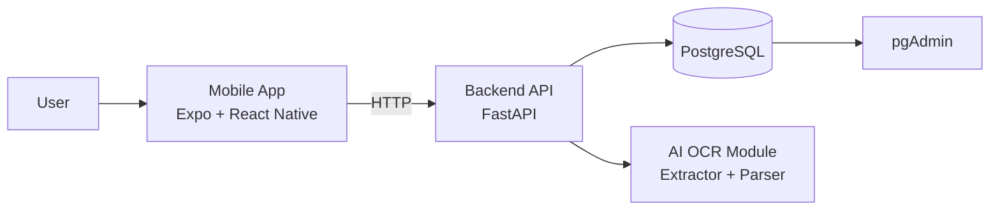
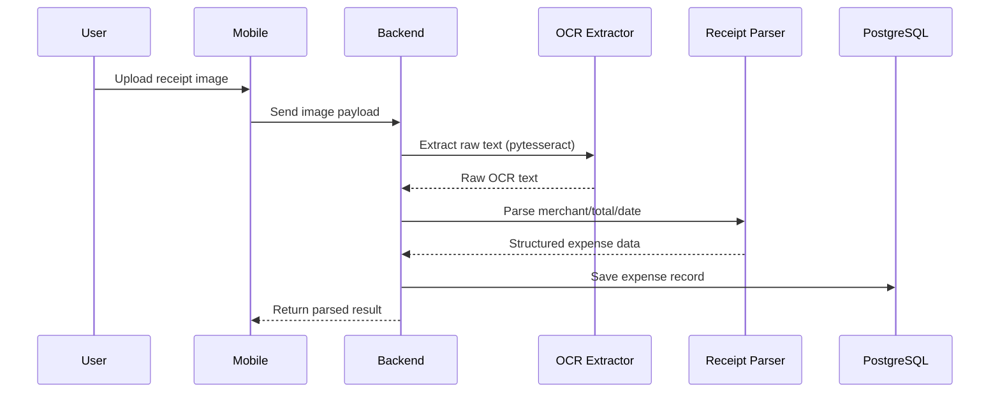

# Expense AI

AI-powered expense tracking app with a mobile client, backend API, and OCR pipeline.

## Architecture Diagram



## AI Flow



## Screenshots

Add your app screenshots under `docs/screenshots` and update links below:

- Mobile Home: `docs/screenshots/home.png`
- Receipt Scan: `docs/screenshots/scan.png`
- Parsed Result: `docs/screenshots/result.png`

Example markdown:

```md


```

## Setup Guide

### 1) Prerequisites

- **Node.js** 20.19+ (required by React Native 0.81 in this repo)
- **npm** 9+ (root declares `packageManager`; use matching npm)
- **Python** 3.12+
- **Docker + Docker Compose** (optional; recommended for Postgres + pgAdmin)
- **iOS native builds**: Xcode, CocoaPods (`pod`). For fewer CocoaPods issues, use a current CocoaPods (for example via Homebrew) or rely on the repo’s `patch-package` fixes after `npm install`.

### 2) Install dependencies

From repo root:

```bash
npm install
```

This runs **`postinstall` → `patch-package`**, which applies patches under `patches/` (for example compatibility tweaks for older CocoaPods with React Native and `react-native-safe-area-context`). Always run `npm install` after cloning or changing branches.

Backend Python dependencies:

```bash
cd apps/backend
python -m venv .venv
source .venv/bin/activate
pip install -r requirements.txt
```

### 3) Environment

Copy or create a **`.env`** at the repo root for Docker (see variables used in `docker-compose.yml`, for example `DATABASE_URL`, `POSTGRES_*`, `OPENAI_API_KEY`, pgAdmin defaults).

### 4) Run app + backend locally

Terminal 1 (mobile, from repo root):

```bash
npm run dev
```

Terminal 2 (backend):

```bash
cd apps/backend
source .venv/bin/activate
uvicorn app.main:app --reload
```

Default API URL for the mobile app is defined in `apps/mobile/src/config/env.ts` (Android emulator uses `http://10.0.2.2:8000`, iOS simulator uses `http://127.0.0.1:8000`). You can override the base URL in the app UI where exposed.

Useful Expo keys (dev server):

- `i`: open iOS simulator (Expo Go / dev client, depending on setup)
- `a`: open Android emulator
- `w`: open web

### 5) Run with Docker

```bash
docker compose up --build
```

Services:

- Backend API: `http://127.0.0.1:8000`
- PostgreSQL: `localhost:5432`
- pgAdmin: `http://127.0.0.1:5050` (credentials from `.env`, for example `PGADMIN_DEFAULT_EMAIL` / `PGADMIN_DEFAULT_PASSWORD`)

## Mobile: HTTP client and native projects

### API client (`apps/mobile/src/lib/api`)

The app uses a small **`createApiClient`** helper (base URL, optional default headers and `getAccessToken` for future auth). Feature modules call `getJson` / `postJson` / `request` on that client instead of repeating `fetch` and URL normalization. Instantiate with `useMemo(() => createApiClient({ baseUrl }), [baseUrl])` when the base URL can change.

### Native iOS / Android (Expo prebuild)

Expo no longer uses `eject`. To generate **`ios/`** and **`android/`**:

```bash
cd apps/mobile
npm run prebuild
# or a clean regenerate:
npm run prebuild:clean
```

`app.json` sets **`ios.bundleIdentifier`** and **`android.package`** (for example `com.expenseai.app`). Adjust them before store release.

After prebuild, install pods:

```bash
cd apps/mobile/ios
pod install
```

Run a **development build** on device/simulator (requires native folders):

```bash
cd apps/mobile
npm run ios
npm run android
```

Those scripts invoke **`expo run:ios`** / **`expo run:android`**. The default `npm run dev` / `expo start` flow is still used for the Metro dev server and Expo Go where applicable.

By default, **`ios/`** and **`android/`** are listed in `apps/mobile/.gitignore`. Remove those lines if you want to commit generated native projects.

## Tech Stack

- Mobile: Expo SDK 54, React Native 0.81, Expo Router, TypeScript
- Backend API: FastAPI, Uvicorn
- AI/OCR: `pytesseract` + custom parser
- Database: PostgreSQL
- Infra/Tools: Docker Compose, Turborepo, npm workspaces, `patch-package`

## Challenges & Solutions

- Monorepo workspace resolution with Turbo:
  - `packageManager` and npm `workspaces` in root `package.json`.
- Local package linking across apps:
  - Shared types via `@expense-ai/shared-types` workspace package.
- Polyglot environment (Node + Python):
  - Split setup into mobile vs backend steps and an isolated Python `venv`.
- OCR quality variance from receipts:
  - Pipeline `extract_text -> parse_receipt` so parsing can evolve independently.
- Local development consistency:
  - Docker Compose for backend + PostgreSQL + pgAdmin.
- Older **CocoaPods** on developer machines (missing `visionos`, rejecting `always_out_of_date` in script phases):
  - Patches under `patches/` applied automatically on `npm install`; upgrading CocoaPods (for example `brew install cocoapods`) is still recommended long term.

## Project Structure

- `apps/mobile`: Expo React Native app (`src/lib/api` HTTP client, `src/features/*` modules)
- `apps/backend`: FastAPI service
- `apps/ai`: OCR and parsing logic
- `packages/shared-types`: shared types package (`@expense-ai/shared-types`)
- `patches/`: `patch-package` diffs for hoisted dependencies (run via root `postinstall`)
- `docker-compose.yml`: local infra orchestration

## Common Commands

From repo root:

```bash
npm install
npm run dev
npm run build
npm run lint
npm run type-check
```

Mobile only:

```bash
npm --workspace mobile run start
npm --workspace mobile run ios
npm --workspace mobile run android
npm --workspace mobile run web
npm --workspace mobile run prebuild
```

## Troubleshooting

If you see:

`Unable to calculate transitive closures: Workspace 'apps/mobile' not found in lockfile`

Run:

```bash
npm install
```

This refreshes `package-lock.json` with workspace entries.

### CocoaPods / `pod install`

- Run **`npm install`** at the repo root so patches apply to `node_modules` before `pod install`.
- If validation errors mention **unknown `visionos`** or **`always_out_of_date`**, your CocoaPods is likely older than what upstream RN 0.81 assumes; the repo patches mitigate that—ensure `postinstall` ran—or upgrade CocoaPods.

### Patches out of date after dependency upgrade

If you bump `react-native` or `react-native-safe-area-context`, `patch-package` may fail until you refresh or remove the matching file under `patches/`. Regenerate with `npx patch-package <package-name>` after editing `node_modules` intentionally, or delete the patch if upstream fixed the issue.
