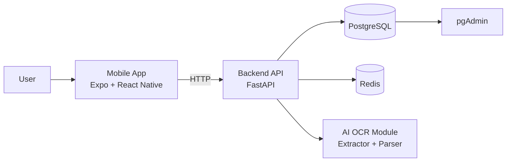
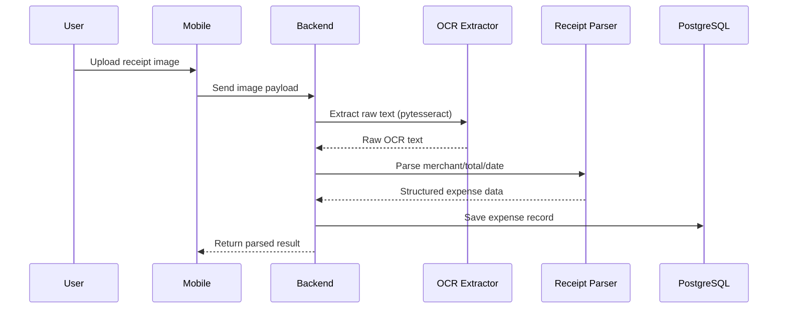

# Expense AI

AI-powered expense tracking app with a mobile client, backend API, and OCR pipeline.

## Architecture Diagram



## AI Flow



## Screenshots

Add your app screenshots under `docs/screenshots` and update links below:

- Mobile Home: `docs/screenshots/home.png`
- Receipt Scan: `docs/screenshots/scan.png`
- Parsed Result: `docs/screenshots/result.png`

Example markdown:

```md


```

## Setup Guide

### 1) Prerequisites

- Node.js 18+ (latest LTS recommended)
- npm 9+
- Python 3.12+
- Docker + Docker Compose (optional but recommended for infra)

### 2) Install dependencies

From repo root:

```bash
npm install
```

Backend Python dependencies:

```bash
cd apps/backend
python -m venv .venv
source .venv/bin/activate
pip install -r requirements.txt
```

### 3) Run app + backend locally

Terminal 1 (mobile, from repo root):

```bash
npm run dev
```

Terminal 2 (backend):

```bash
cd apps/backend
source .venv/bin/activate
uvicorn app.main:app --reload
```

Useful Expo keys:

- `i`: open iOS simulator
- `a`: open Android emulator
- `w`: open web

### 4) Run with Docker

```bash
docker compose up --build
```

Services:

- Backend API: `http://127.0.0.1:8000`
- PostgreSQL: `localhost:5432`
- pgAdmin: `http://127.0.0.1:5050` (`admin@example.com` / `admin`)

## Tech Stack

- Mobile: Expo, React Native, Expo Router
- Backend API: FastAPI, Uvicorn
- AI/OCR: `pytesseract` + custom parser
- Database: PostgreSQL
- Cache/Queue foundation: Redis
- Infra/Tools: Docker Compose, Turborepo, npm workspaces, TypeScript

## Challenges & Solutions

- Monorepo workspace resolution with Turbo:
  - Added `packageManager` and npm `workspaces` in root `package.json`.
- Local package linking across apps:
  - Linked shared package via workspace-compatible dependency setup.
- Polyglot environment (Node + Python):
  - Split setup into clear mobile/backend steps and isolated Python `venv`.
- OCR quality variance from receipts:
  - Structured flow `extract_text -> parse_receipt` so parsing logic can evolve independently.
- Local development consistency:
  - Added Docker flow for backend + PostgreSQL + pgAdmin to reduce machine-specific issues.

## Project Structure

- `apps/mobile`: Expo React Native app
- `apps/backend`: FastAPI service
- `apps/ai`: OCR and parsing logic
- `apps/packages/shared-types`: shared types package
- `docker-compose.yml`: local infra orchestration

## Common Commands

From repo root:

```bash
npm run dev
npm run build
npm run lint
npm run type-check
```

Mobile only:

```bash
npm --workspace mobile run start
npm --workspace mobile run ios
npm --workspace mobile run android
npm --workspace mobile run web
```

## Troubleshooting

If you see:

`Unable to calculate transitive closures: Workspace 'apps/mobile' not found in lockfile`

Run:

```bash
npm install
```

This refreshes `package-lock.json` with workspace entries.
