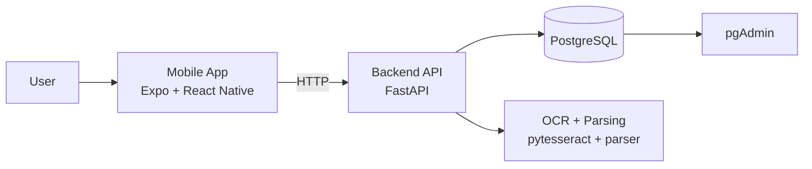

# Expense AI

Expense AI is a monorepo for a receipt-aware expense assistant:

- Mobile app: Expo + React Native
- Backend API: FastAPI + PostgreSQL (pgvector ready)
- Shared package: `@expense-ai/shared-types`

## Architecture



## Project Structure

- `apps/mobile`: React Native app (Expo Router)
- `apps/backend`: FastAPI service, OCR/parser logic, DB models
- `packages/shared-types`: shared workspace package
- `patches/`: `patch-package` fixes applied at `postinstall`
- `docker-compose.yml`: backend + postgres + pgAdmin local stack

## Prerequisites

- Node.js 20.19+ and npm 10+ (root uses `npm@10.9.3`)
- Python 3.12+
- Docker + Docker Compose (recommended for DB)
- iOS native build only: Xcode + CocoaPods

## Quick Start (Local)

### 1) Install workspace dependencies

From repo root:

```bash
npm install
```

`postinstall` automatically runs `patch-package`, so run this after clone and after pulling dependency changes.

### 2) Setup backend Python environment

```bash
cd apps/backend
python -m venv .venv
source .venv/bin/activate
pip install -r requirements.txt
```

### 3) Configure environment variables

Create a root `.env` file (used by Docker and backend runtime), including at least:

- `DATABASE_URL`
- `POSTGRES_USER`
- `POSTGRES_PASSWORD`
- `POSTGRES_DB`
- `OPENAI_API_KEY`
- `PGADMIN_DEFAULT_EMAIL`
- `PGADMIN_DEFAULT_PASSWORD`

### 4) Run backend

```bash
cd apps/backend
source .venv/bin/activate
uvicorn app.main:app --reload
```

Backend runs at `http://127.0.0.1:8000`.

### 5) Run mobile app

From repo root:

```bash
npm --workspace mobile run dev
```

Useful Expo keys:

- `i`: open iOS simulator
- `a`: open Android emulator
- `w`: open web

Default mobile API URLs are configured in `apps/mobile/src/config/env.ts`.

## Docker Setup

Run all local services:

```bash
docker compose up --build
```

Endpoints:

- Backend API: `http://127.0.0.1:8000`
- PostgreSQL: `127.0.0.1:5432`
- pgAdmin: `http://127.0.0.1:5050`

## Common Commands

From repo root:

```bash
npm run dev
npm run build
npm run lint
npm run type-check
```

Mobile workspace:

```bash
npm --workspace mobile run start
npm --workspace mobile run ios
npm --workspace mobile run android
npm --workspace mobile run prebuild
npm --workspace mobile run prebuild:clean
```

## Troubleshooting

### Workspace lockfile mismatch

If you see lockfile/workspace resolution errors, run:

```bash
npm install
```

### CocoaPods issues

- Always run `npm install` before `pod install` so `patch-package` fixes are applied.
- If you see `visionos` / `always_out_of_date` validation errors, update CocoaPods or re-run install to ensure patches were applied.

### Patch failures after dependency upgrades

If dependency versions changed, patch files in `patches/` may need regeneration:

```bash
npx patch-package <package-name>
```
